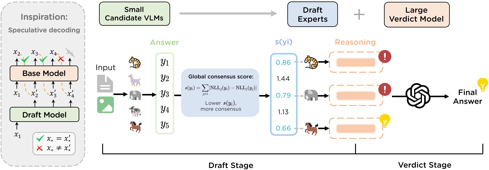

# Small Drafts, Big Verdict: Information-Intensive Visual Reasoning via Speculation

## 📝 Table of Contents

- [Overview](#overview)
- [Project Structure](#project-structure)
- [Installation](#installation)
  - [Download Datasets](#download-datasets)
- [Quick Start](#quick-start)
- [Usage](#usage)
  - [Modes](#modes)
  - [Parameters](#parameters)
- [Advanced Usage](#advanced-usage)
  - [Using Annotated Images](#using-annotated-images)
  - [Adding Custom Models](#adding-custom-models)
- [Evaluation](#evaluation)

## Overview




## Project Structure

```
specverdict/
├── main.py                  # Main entry point for all pipeline stages
├── draft.py                 # Draft stage: support inference and consensus scoring
├── verdict.py               # Verdict stage
├── consensus_scoring.py     # Consensus-based expert ranking
├── prompts.py               # Dataset-specific prompts
├── model.py                 # Model wrappers
├── utils/                   # Post-processing utilities
├── eval/                    # Evaluation framework
├── layout_annotation/       # Optional: OCR-based image annotation for information-intensive benchmarks
└── requirements.txt
```

## Installation

```bash
git clone https://github.com/Tinaliu0123/speculative-verdict.git
cd specverdict
conda create -n specverdict python=3.10
conda activate specverdict 

export OPENAI_API_KEY="your-key"
pip install -r requirements.txt
pip install https://github.com/Dao-AILab/flash-attention/releases/download/v2.7.4.post1/flash_attn-2.7.4.post1+cu12torch2.6cxx11abiFALSE-cp310-cp310-linux_x86_64.whl
```

**Note:** For LLaVA-OneVision, use `transformers==4.53.0` instead of the default version.

### Download Datasets

- **InfographicVQA**: [DocVQA Datasets](https://www.docvqa.org/datasets/infographicvqa)
- **ChartMuseum**: [GitHub Repository](https://github.com/nunonmg/chartmuseum)
- **ChartQAPro**: [HuggingFace](https://huggingface.co/datasets/nyu-visionx/ChartQA-Pro)
- **HR-Bench**: [GitHub Repository](https://github.com/opencompass/HR-Bench)

## Quick Start

### Example: Complete Pipeline on InfographicVQA

```bash
# 1. Initial inference with 5 candidate models (QA mode)
python main.py \
    --mode inference \
    --inference_mode qa \
    --models path/to/model1 path/to/model2 path/to/model3 path/to/model4 path/to/model5\
    --dataset infovqa \
    --in_json data/infovqa/test.jsonl \
    --out_json results/qa_inference.json

# 2. Compute consensus scores
python main.py \
    --mode prefill_cross \
    --models path/to/model1 path/to/model2 path/to/model3 path/to/model4 path/to/model5\
    --in_json results/qa_inference.json \
    --out_json results/prefill.json

# 3. Select top-3 draft experts
python consensus_scoring.py \
    --input results/prefill.json \
    --output results/consensus.json \
    --top_k 3

# 4. Draft experts generate detailed reasoning (reason mode)
python main.py \
    --mode inference_from_topk \
    --inference_mode reason \
    --model_mapping '{"model1":"path/to/model1", "model2":"path/to/model2", ...}' \
    --consensus_file results/consensus.json \
    --in_json data/infovqa/test.jsonl \
    --out_json results/draft_reason.json

# 5. Final verdict synthesis
python main.py \
    --mode verdict \
    --models path/to/verdict_model \
    --in_json results/draft_reason.json \
    --out_json results/verdict.json \
    --dataset infovqa \
    --annotated_folder data/annotations/infovqa/  # optional
```

## Usage

### Modes

**Pipeline Modes:**
- `inference`: Generate reasoning/answers from multiple models
- `prefill_cross`: Compute consensus scores
- `inference_from_topk`: Inference only for selected draft experts
- `verdict`: Synthesize reasoning into final answer

**Inference Modes:**
- `qa`: Direct question answering
- `reason`: Step-by-step reasoning

### Parameters

| Parameter | Description | Example |
|-----------|-------------|---------|
| `--dataset` | Dataset type | `infovqa`, `museum`, `pro`, `hrbench` |
| `--inference_mode` | Inference type | `qa`, `reason` |
| `--models` | Model paths (space-separated) | `path/to/model1 path/to/model2`... |
| `--in_json` | Input file path | `data/test.jsonl` |
| `--out_json` | Output file path | `results/output.json` |
| `--start_idx` | Start from specific sample | `0` |
| `--max_entries` | Process N samples only | `100` |
| `--seed` | Random seed | `42` |
| `--merge_output` | Update and merge into existing file | flag |

**Verdict-specific:**
- `--annotated_folder`: Folder containing layout-annotated images for information-intensive tasks

**Consensus-specific:**
- `--top_k`: Number of models to select (default: 3)

## Advanced Usage

### Using Annotated Images

Generate and use layout-annotated images for information-intensive tasks:
```bash
# 1. Generate layout-annotated images
python layout_annotation/pipeline.py \
    --input data/infovqa/images/ \
    --output data/infovqa/annotated/

# 2. Use in verdict stage
python main.py \
    --mode verdict \
    --annotated_folder data/infovqa/annotated/ \
    ...
```

See [layout_annotation/README.md](layout_annotation/README.md) for details.

### Adding Custom Models

We currently support: Qwen2.5-VL, GLM-4V, MiMO, InternVL3/3.5, Ovis2.5, LLaVA-OneVision, Eagle2.5, Gemma3.

To add your own model, modify two files:

1. **`draft.py`**: Add model loading logic in `load_vlm()`
2. **`model.py`**: Create wrapper class with:
- `answer(img_path, question, prompt_tpl)` → Generate response
- `prefill_nll(img_path, question, answer)` → Conduct masking and compute perplexity score 

See existing implementations for reference.

## Evaluation

Evaluate final results against ground truth, following each dataset's evaluation metrics:

```bash
# InfographicVQA (ANLS metric)
python eval/eval.py infovqa \
    --input results/verdict.json \
    --output eval_results.json

# ChartQAPro (relaxed accuracy)
python eval/eval.py chartqapro \
    --input results/verdict.json \
    --meta data/chartqapro/metadata.jsonl

# ChartMuseum (GPT-based scoring)
python eval/eval.py chartmuseum \
    --input results/verdict.json
```

See [eval/README.md](eval/README.md) for detailed evaluation documentation.


<!-- ## Citation

If you use this code, please cite:

```bibtex
``` -->
